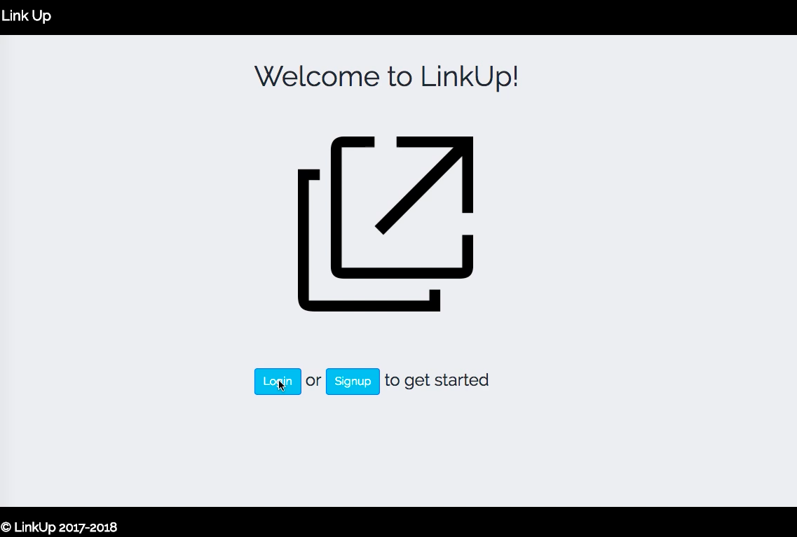
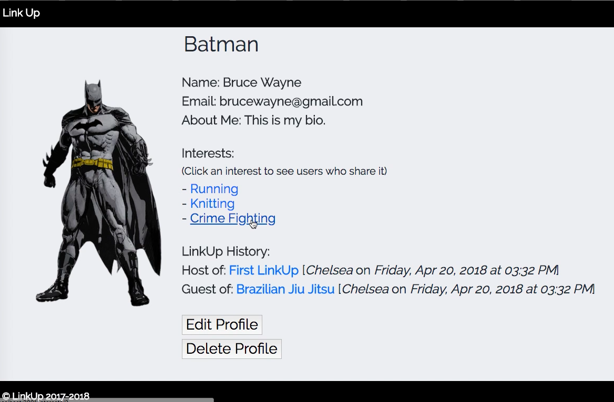
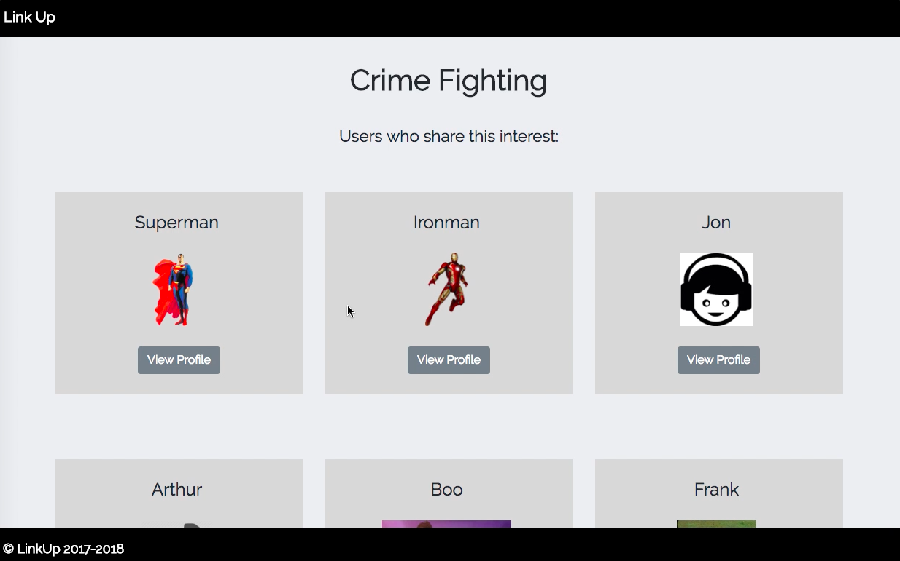
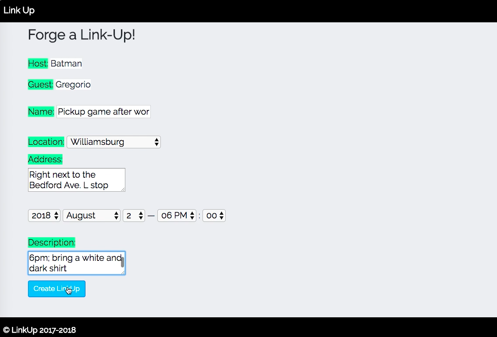
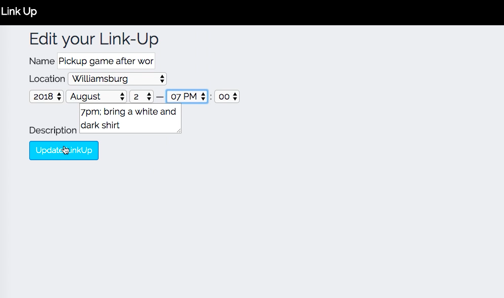
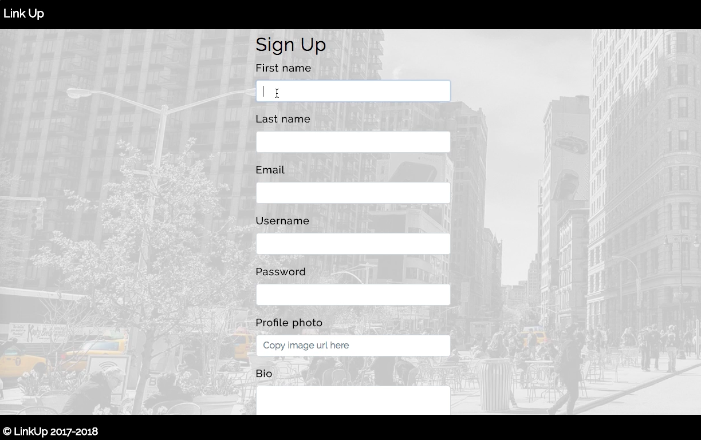

## LinkUp
A companion finder based on shared interests, inspired by Meetup.

## Motivation
This was a pair-programming student project, created in my second module for Flatiron School's immersive web development program.
 
## Screenshots














## Tech/framework used

<b>Built with</b>
- Ruby on Rails

## Installation


   ```$ bundle install```

   ```$ rails db:create```

   ```$ rails db:migrate```
   
   ```$ rails db:seed```

   ```$ rails s```
